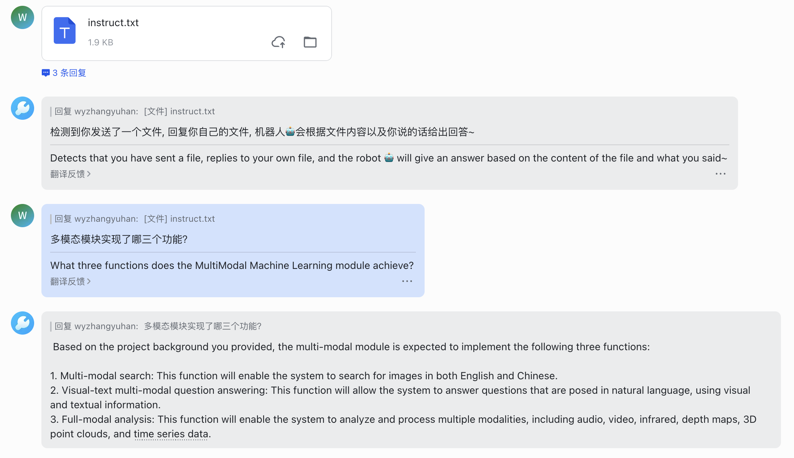
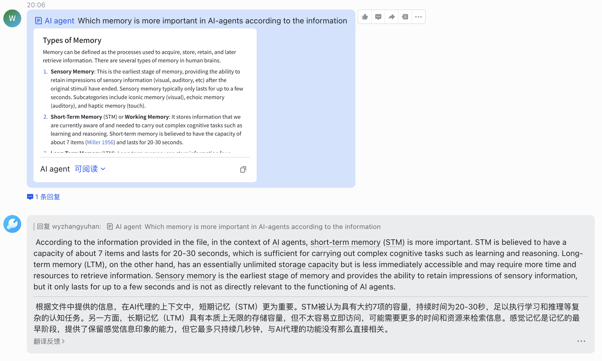

<h1 align="center">
    GoLang-Chain-Lark
</h1>

Welcome to GoLang-Chain-Lark! This repository is my personal exploration into the world of Golang, Langchain, and AI agents. Through this project, I've implemented a Lark Suite Robot🤖️ as a means to delve deeper into these topics. While it serves as a foundational starting point for further expansions and integrations, it's primarily a space for learning and experimentation.

## Features 🌟

- LLM Integration 🧠: Integrated the llama2-chat-13b model via text-generation-inference. 

- Advanced Parsing 📄✨: The robot can understand and parse the content of files sent by users.
  - Support simple `.txt` file
  - Lark wikis and docs

- Flexibility 🔄: The project is designed to easily switch between different models.

- User-Friendly Interactions 🤝: The current setup supports private chats with single round interactions.

## Roadmap (To-Do) 🚀

- Dive into group chats and multi-round conversations 🗣️

- Explore support for additional file formats 📂

- Investigate integration with retrieval services like milvus 🔍

## Development Status 🛠️

This project is a continuous journey of learning and experimentation. While it's in the development stage, I'm always looking for new insights and avenues to explore within Golang, Langchain, and AI.

## References 📚

- [ConnectAI-E/Feishu-OpenAI](https://github.com/ConnectAI-E/Feishu-OpenAI)

- [Langchain](https://github.com/langchain-ai/langchain)

- [LarkSuite SDK](https://github.com/larksuite/oapi-sdk-gin)

- [Llama2](https://huggingface.co/meta-llama)

- [Milvus](https://github.com/milvus-io/milvus)

- [Text-generation-inference](https://github.com/huggingface/text-generation-inference)

## Note 📝
While this is a personal study project, I'm open to feedback, suggestions, and discussions. Feel free to fork the repository, submit a pull request, or open an issue if you have any insights or ideas to share.