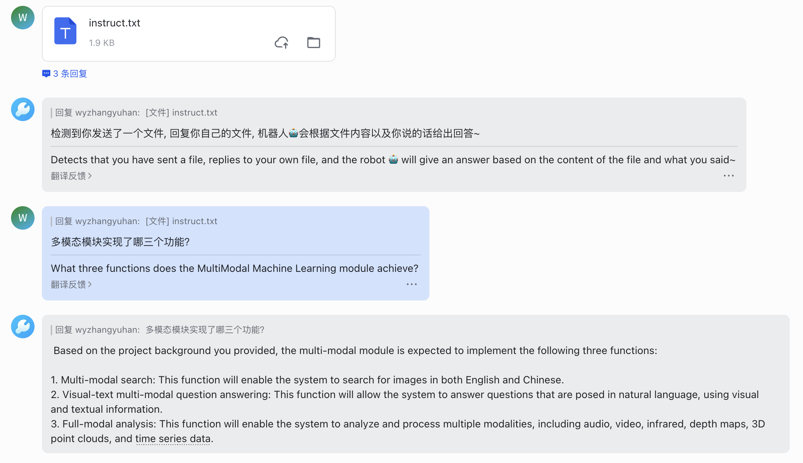
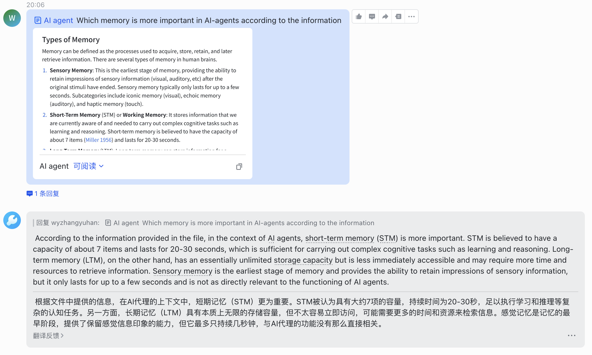

<h1 align="center">
    GoLang-Chain-Lark
</h1>

LLM与飞书机器人结合的AI-Agent实现～

## Features 🌟

- LLM 🧠：通过`Text-Generation-inference`整合了 llama2-chat-13b 模型。

- 支持对飞书文档的解析 📄✨：机器人可以理解和解析用户发送的文件内容。
  - 支持 `.txt` 文件
  - 飞书Wikis和飞书文档

- 灵活性 🔄：该项目可以轻松地在不同的模型之间切换。

- 用户友好的互动 🤝：当前的设置支持与单轮互动的私人聊天。

## Roadmap (To-Do) 🚀

- 群聊和多轮对话 🗣️

- 探索对其他文件格式的支持 📂

- 探索与像 milvus 这样的检索服务的集成 🔍

## Development Status 🛠️

持续开发中，目标是出一个基于飞书的AI-Agent应用

## References 📚

- [ConnectAI-E/Feishu-OpenAI](https://github.com/ConnectAI-E/Feishu-OpenAI)

- [Langchain](https://github.com/langchain-ai/langchain)

- [LarkSuite SDK](https://github.com/larksuite/oapi-sdk-gin)

- [Llama2](https://huggingface.co/meta-llama)

- [Milvus](https://github.com/milvus-io/milvus)

- [Text-generation-inference](https://github.com/huggingface/text-generation-inference)

## Note 📝
欢迎反馈、建议和讨论。
